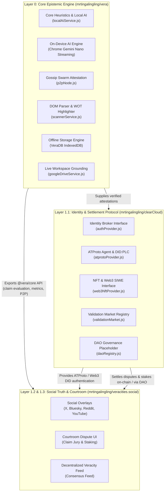

# Vera Ecosystem Architecture Blueprint

## 1. High-Level System Architecture

The Vera ecosystem comprises a modular, decentralized stack separating client runtimes, identity broker networks, and public truth-settlement interfaces:



---

## 2. Layer Definitions & Repositories

### Layer 0: Core Epistemic Engine ([`mrtingalingling/vera`](https://github.com/mrtingalingling/vera))
- **Execution Environment**: Chrome Extension (MV3), Browser Web Worker, Node.js.
- **Key Modules**:
  - `localAiService.js`: On-device Chrome Gemini Nano streaming & local heuristic pipeline.
  - `p2pNode.js`: Decentralized browser gossip swarm for peer attestation.
  - `scannerService.js`: Bi-directional active tab scanning and 4-category DOM highlights.
  - `db.js`: Zero-leakage client-side IndexedDB persistence (`VeraDB` v1).
  - `googleDriveService.js`: Live REST grounding for Google Docs and Sheets.
- **Consumption Mode**: Exposes `@vera/core` ES module (`frontend/src/index.js`) for downstream repositories.

---

### Layer 1.1: Decentralized Identity & Settlement ([`mrtingalingling/clearCloud`](https://github.com/mrtingalingling/clearCloud))
- **Execution Environment**: Node.js / Cloud Run / Serverless Edge.
- **Key Modules**:
  - `src/identity/atprotoProvider.js`: ATProto authentication (`@atproto/api`), handle validation (`user.bsky.social`), DID PLC directory resolution (`did:plc:...`).
  - `src/identity/web3NftProvider.js`: Extensible Web3 interface for Ethereum/EVM wallet signatures (EIP-4361 / SIWE) and NFT token-gating.
  - `src/market/validationMarket.js`: Validation Market prediction registry, truth stake pools, and automated oracle payout calculation.
  - `src/governance/daoRegistry.js`: DAO proposal governance, quorum evaluation, and reputation-weighted consensus.

---

### Layer 1.2 & 1.3: Social Truth Suite & Courtroom ([`mrtingalingling/veracities.social`](https://github.com/mrtingalingling/veracities.social))
- **Execution Environment**: Modern Web Application (Next.js / SvelteKit / Cloudflare Pages).
- **Key Modules**:
  - Social Feed Overlays: In-feed fact-checking cards for Bluesky, X, Reddit, and YouTube.
  - Courtroom Jury UI: Stake-backed claim dispute hearings, evidence submission, and community verdict voting.
  - Integrations: Uses `clearCloud` for ATProto DID authentication and `vera` for epistemic scoring.

---

## 3. Dependency & Contract Interfaces

```
┌──────────────────────────────────────────────┐
│             veracities.social                │
│    (Courtroom UI & Social Truth Feed)        │
└───────────────┬──────────────────────────────┘
                │
                ├───> Imports @vera/core (Claims, Metrics, P2P)
                │
                └───> Imports clearCloud/identity (ATProto Session & DID)
                      Imports clearCloud/market (Staking & Disputes)
```
