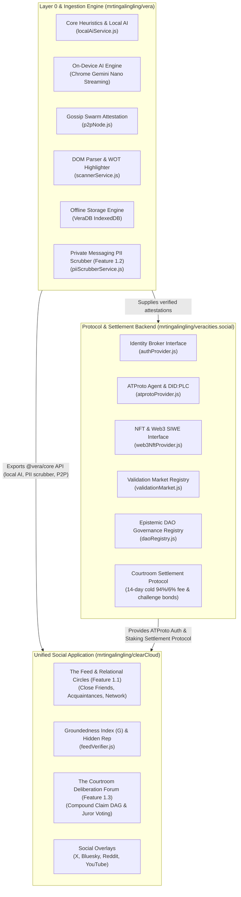

# Vera Ecosystem Architecture Blueprint

## 1. High-Level System Architecture

The Vera ecosystem comprises a modular, decentralized stack separating client runtimes, identity broker networks, and public truth-settlement interfaces:

---

## 2. Layer Definitions & Repositories

### Layer 0 & Ingestion Engine ([`mrtingalingling/vera`](https://github.com/mrtingalingling/vera))
- **Execution Environment**: Chrome Extension (MV3), Browser Web Worker, Node.js.
- **Key Modules**:
  - `localAiService.js`: On-device Chrome Gemini Nano streaming & local heuristic pipeline.
  - `piiScrubberService.js` (**Feature 1.2**): On-device zero-leakage PII scrubber and core claim extractor for WhatsApp Web, Telegram Web, Signal, and WeChat.
  - `p2pNode.js`: Decentralized browser gossip swarm for peer attestation.
  - `scannerService.js`: Bi-directional active tab scanning and 4-category DOM highlights.
  - `db.js`: Zero-leakage client-side IndexedDB persistence (`VeraDB` v1).
  - `googleDriveService.js`: Live REST grounding for Google Docs and Sheets.
- **Consumption Mode**: Exposes `@vera/core` ES module (`frontend/src/index.js`) for downstream applications and protocols.

---

### Protocol & Settlement Backend ([`mrtingalingling/veracities.social`](https://github.com/mrtingalingling/veracities.social))
- **Execution Environment**: Node.js / Cloud Run / Serverless Edge / Smart Contract Interfaces.
- **Key Modules**:
  - `src/identity/atprotoProvider.js`: ATProto authentication (`@atproto/api`), handle validation (`user.bsky.social`), DID PLC directory resolution (`did:plc:...`).
  - `src/identity/web3NftProvider.js`: Extensible Web3 interface for Ethereum/EVM wallet signatures (EIP-4361 / SIWE) and NFT token-gating.
  - `src/market/validationMarket.js`: Validation Market prediction registry, truth stake pools, and automated oracle payout calculation.
  - `src/governance/daoRegistry.js`: Epistemic DAO registry ("EnDAOsment") with weighted voting, proposal lifecycle, and quorum thresholds.
  - `src/settlement/courtroomSettlement.js`: Courtroom settlement rules (14-day cold case 94% refund / 6% fee, anti-spam challenge bond escrow, jury consensus tally protocol).

---

### Unified Social Application ([`mrtingalingling/clearCloud`](https://github.com/mrtingalingling/clearCloud))
- **Execution Environment**: Web Application / Progressive Web App.
- **Key Modules**:
  - `src/feed/` (**Feature 1.1**): Relational Circles (Tier 1 Close Friends, Tier 2 Friends/Acquaintances, Tier 3 Network-Wide), Groundedness Index ($G$) ranking, and Asymmetric Hidden Reputation engine.
  - `src/courtroom/` (**Feature 1.3**): The Courtroom deliberation docket, Falsifiability Gatekeeper, Compound Claim DAG hierarchical decomposition, and Juror voting interface.
  - `src/social/overlayService.js`: Social card and badge generator for Bluesky, X/Twitter, Reddit, and YouTube.
  - Consumes `veracities.social` for identity/market/settlement protocol and `@vera/core` for on-device AI & PII scrubbing.
