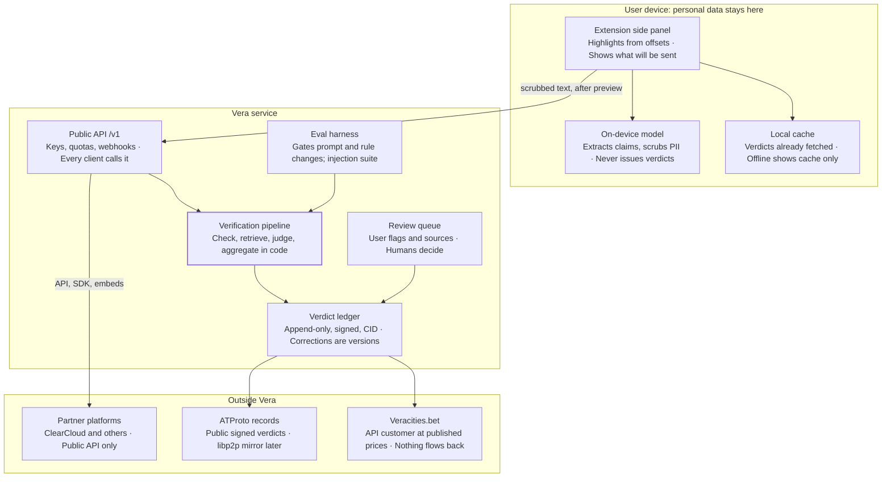

# Vera diagrams

GitHub renders these Mermaid blocks natively. The matching `.svg` files reproduce the doc's layout exactly.

## Architecture

```mermaid
flowchart TB
  subgraph Device["User device: personal data stays here"]
    Panel["Extension side panel<br/>Highlights from offsets · Shows what will be sent"]
    Local["On-device model<br/>Extracts claims, scrubs PII · Never issues verdicts"]
    Cache["Local cache<br/>Verdicts already fetched · Offline shows cache only"]
  end
  subgraph Service["Vera service"]
    API["Public API /v1<br/>Keys, quotas, webhooks · Every client calls it"]
    Pipe["Verification pipeline<br/>Check, retrieve, judge, aggregate in code"]
    Eval["Eval harness<br/>Gates prompt and rule changes; injection suite"]
    Ledger["Verdict ledger<br/>Append-only, signed, CID · Corrections are versions"]
    Review["Review queue<br/>User flags and sources · Humans decide"]
  end
  subgraph Outside["Outside Vera"]
    Partners["Partner platforms<br/>ClearCloud and others · Public API only"]
    AT["ATProto records<br/>Public signed verdicts · libp2p mirror later"]
    Bet["Veracities.bet<br/>API customer at published prices · Nothing flows back"]
  end
  Panel --> Local
  Panel --> Cache
  Panel -- "scrubbed text, after preview" --> API
  API --> Pipe
  Eval --> Pipe
  Pipe --> Ledger
  Review --> Ledger
  Ledger --> AT
  Ledger --> Bet
  API -- "API, SDK, embeds" --> Partners
  style Pipe stroke-width:2px
```

## Roadmap

```mermaid
flowchart LR
  P0["Phase 0<br/>Honest baseline"] --> G0{{"Gate 0<br/>Docs match code"}}
  G0 --> P1["Phase 1<br/>Verification core"] --> G1{{"Gate 1<br/>Eval targets met"}}
  G1 --> P2["Phase 2<br/>API and SDK v1"] --> G2{{"Gate 2<br/>API v1 frozen"}}
  G2 --> P3["Phase 3<br/>Extension v2"] --> G3{{"Gate 3<br/>Privacy audited"}}
  G3 --> P4["Phase 4<br/>Ledger, ATProto"] --> G4{{"Gate 4<br/>Corrections work"}}
  G4 -.-> L["Later<br/>libp2p mirror"]
  style P0 stroke-width:2px
```
