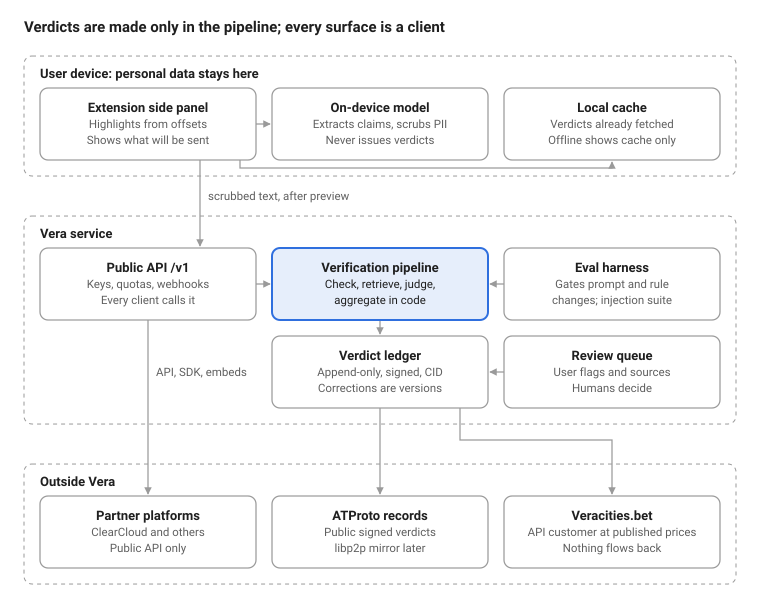
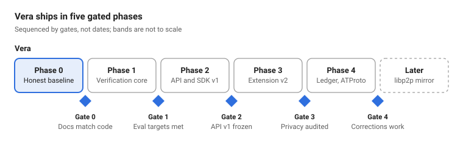

# Vera: Standalone AI Verification Agent

Oct 5, 2026 · @Ting

Vera is a standalone AI agent that tells a reader whether a claim is supported by evidence, with a confidence, and says so when it can't tell. This document is complete on its own: any platform can embed Vera through its public SDK and API. ClearCloud and Veracities.bet are two such customers, and Ecosystem covers what spans all three products, including the status vocabulary (Proposed, Confirmed, Prototyped, Audited).

## Brief

**Purpose.** Tell a reader whether a specific claim is supported by evidence, show that evidence, and say "insufficient evidence" when it can't tell.

**Users.** Platforms and services that embed Vera as an AI plug-in, including ClearCloud and Veracities.bet, and individuals using the browser extension. Vera investigates and reports evidence; it never decides a challenge or settles money.

**In scope.** Claim extraction, verification pipeline, verdict ledger, public API, SDK, embeddable components, extension, on-device PII scrubbing, corrections workflow.

**Out of scope.** Feeds, user reputation scores, wagering, governance, and any money flow tied to verdict outcomes.

**Success measure.** Verdict accuracy and calibration on the eval set (targets set at Gate 1), plus the share of user-flagged errors corrected within the agreed window.

**Constraints.** Neutral by design: no product or partner can pay to change a verdict, and no outcome elsewhere feeds back into verdicts. No view, ranking, or tier ever places outlets, authors, or claims on a political axis. Vera is funded only from API fees, charged at published prices to every customer alike, and ClearCloud's non-betting earnings, on a multi-year budget fixed and published in advance, never set by market volume; Veracities.bet fees above Vera's cost of serving it go to a segregated pool that never funds Vera (ADR-015).

**Prototype features and where they went.** Every feature the current README describes has a place in this plan or a ticket that removes it.

| Feature in the current repo | Status now | Where it goes |
| --- | --- | --- |
| Svelte 5 web cockpit and extension popup | Prototyped | Kept as a client of the API (ADR-002); the popup becomes the side panel (V-302) |
| Four-color DOM highlighting and hover cards | Prototyped | Six-verdict taxonomy (ADR-003), offset highlighting (V-303), cards in a closed shadow root (V-003) |
| Time-bound tab permissions | Prototyped | Optional host permissions with timed revoke (V-301) |
| On-device PII scrubber and Gemini Nano | Prototyped | Stage 1 scrubber (V-112, V-308) and local model manager (V-307) |
| Bring-your-own-model presets and keys | Prototyped | Direct-to-provider adapter and one model panel (V-208, ADR-013); the canned guest agent is removed (V-001) |
| Google Drive, Docs, and Sheets evidence sources | Prototyped | Kept as user-supplied sources, scrubbed before send (V-012) |
| Fact-versus-opinion mini-charts | Prototyped | Checkable-claims gauge (V-311) |
| Fact catalog in Firestore and global fact sharing | Prototyped | Replaced by the verdict ledger (ADR-006); sharing removed (V-109) |
| Vertex AI Memory Bank | Prototyped | Removed; the ledger is the one store (ADR-006) |
| Vertex AI RAG Engine | Prototyped | Methodology and style guidance only (ADR-004) |
| A2UI detail cards and Agent Engine code executor | Prototyped | Retired with the ADK agent (ADR-014); cards replaced by `@vera/embed` (V-206) |
| Video generation and Cloud Storage hosting | Prototyped | Deleted (V-012) |
| libp2p swarm | Prototyped | Stub switched off (V-008); later mirror (ADR-007) |
| EnDAOsment governance contracts | Prototyped | Belong to ClearCloud; moving to its repo (C-012) |
| Agent-to-agent (A2A) support on the ADK | Prototyped | Rebuilt as an MCP server and an A2A endpoint over the public API (V-212) |

## Shared protocol

**Purpose.** Let any platform read, verify, and republish verdicts without depending on Vera's servers.

**Contents.**

- **Identity:** ATProto DIDs; one DID may be used across products, but no product reads another's private data without explicit user opt-in.
- **Records:** Vera's verdict, evidence, attestation, and retraction records as ATProto lexicons under app.veracities.\*. Other products publish their own records under their own namespaces, such as ClearCloud's social.clearcloud.\* (ClearCloud design document). Vera's namespace is `app.veracities.*`, on Vera's domain, veracities.app (Confirmed).
- **Addressing:** every record is content-addressed by CID and signed by its author's DID, so the same record can travel over ATProto or a libp2p mirror.
- **Packages:** `@vera/protocol` (schemas and validators) and `@vera/core` (SDK), semantically versioned. Record schemas change only backward-compatibly: new fields are optional, and required fields are never removed or renamed without a version bump.

## Design doc: Vera

Vera verifies claims through a fixed pipeline of stages with structured outputs; chat, the extension, and partner platforms are all clients of that pipeline, not the place verdicts are made.

### Goals and non-goals

**Goals.**

1. Every verdict is backed by retrieved, linked evidence, or it says "insufficient evidence".
2. Verdicts are reproducible: the same claim, evidence snapshot, and pipeline version give the same verdict.
3. Personal data is scrubbed by the Vera client before any network call, and private text leaves only after the user has seen exactly what will be sent and agreed.
4. Any platform can embed Vera through a stable, versioned API.

**Non-goals.** User reputation, feeds, wagering, governance, and real-time verification of every sentence on every page.

### Architecture



Personal data stops at the device boundary. Scrubbing is the first stage and runs inside the Vera client before any network call: in the extension, or in Vera's SDK embedded in a host app or server such as ClearCloud's. Private text (messages, logged-in pages, drafts) is previewed and approved before it is sent; public pages and already-published posts are scrubbed without a prompt. The same holds when claim extraction falls back to the server and before any agent-to-agent token exchange. Partners and Veracities.bet read from Vera but never write back into verdicts.

### Pipeline stages

| # | Stage | Runs on | Input | Output |
| --- | --- | --- | --- | --- |
| 1 | PII scrub and preview | Vera client, before any network call: the extension, or Vera's SDK inside a host app or server | Page or message text | Scrubbed text with an offset map back to the original; private text is previewed and confirmed before it is sent |
| 2 | Claim extraction | Device (Gemini Nano or small model); the server fallback receives only scrubbed text, approved when private | Scrubbed text | Atomic claims with source offsets, mapped back to the original text |
| 3 | Check-worthiness | Server | Claim | `checkable` or `not-checkable` (opinion, prediction, value judgment) with reason, plus a flag when it names a private individual |
| 4 | Retrieval | Server | Checkable claim | Ranked evidence from live web search, each with URL, publisher, author, date, credibility tier, and origin cluster |
| 5 | Stance judgment | Server | Claim + one representative evidence item per origin cluster | `supports`, `refutes`, `mixed`, or `irrelevant`, with the quoted span relied on |
| 6 | Aggregation | Server, deterministic code | All stances | Verdict, confidence, rationale |
| 7 | Ledger write | Server | Verdict + evidence | Versioned, signed verdict record |

Stages 3 and 5 are model calls with schema-constrained JSON output; a response that fails validation is retried once, then the claim gets `insufficient-evidence`. Stage 6 has no model in it. All server stages run in Rust (ADR-014).

### Verdict taxonomy

| Verdict | Meaning | Initial aggregation rule (tuned at Gate 1) |
| --- | --- | --- |
| `verified` | Independent credible sources support it | 2+ independent sources in the top credibility tier support; none in that tier refutes |
| `misinformed` | Credible sources refute it | 2+ independent top-tier sources refute; none in that tier supports |
| `disputed` | Credible sources conflict | Top-tier sources both support and refute |
| `needs-context` | True only with a missing qualifier | Majority of relevant stances are `mixed` |
| `insufficient-evidence` | Can't tell | Any other case, and every failure path |
| `not-checkable` | Not a factual claim | Set at stage 3 |

"Independent" means different publishers that do not cite each other for this claim and don't share a content origin. Retrieval groups evidence by origin (matching content hashes and near-duplicate text, such as syndicated wire copy), counts each origin cluster once, and judges stance on one representative per cluster to save model calls. Credibility tiers are a maintained list with a published methodology, versioned like code.

### Data model

- **Claim:** `claim_id` (hash of normalized text), text (kept off public records and deletable), language, first-seen time.
- **Evidence:** URL, publisher, author, published date, retrieved time, content hash, `origin_cluster_id`, quoted span, credibility tier.
- **Origin cluster:** `origin_cluster_id`, earliest known source, member evidence items, matching method (exact hash or near-duplicate).
- **Source registry:** outlets and authors, each with their record across verdicts (evidence later rated `misinformed`, corrections issued), ownership and funding links, and conflict-of-interest records. Every entry links to public, citable evidence.
- **Verdict:** `verdict_id`, `claim_id`, verdict, confidence, rationale, evidence list with stances, `pipeline_version`, `methodology_version`, created time, `expires_at`, supersedes.
- **Retraction:** `verdict_id`, reason, replacement `verdict_id`.

The source registry changes credibility tiers only through a human-reviewed methodology version, never automatically, so Vera's own verdicts can't loop back into the tiers that produce them. A named author enters a repeated-violation or conflict-of-interest record only after human review, with the evidence linked and a way to reply; records describe published work and public money trails, not private lives.

Verdicts are append-only. A correction creates a new version that supersedes the old one; nothing is edited in place. Claims about current events get short expiries and are re-checked on read after expiry.

**Ledger privacy.** Public records carry a hash of the claim text, not the text; the text sits in Vera's own store, where it can be deleted, so a published record stays verifiable after its text is removed. Stage 3 flags claims that name a private individual, with human review for borderline cases, and verdicts on those claims are never published to ATProto; they are available only through the API. A signed redaction record withdraws a published record's text and says why, and webhooks and mirrors honor it.

### Hallucination checks

Vera's verdicts are probabilistic, so each carries a confidence. Anyone can request a hallucination check, including extension users with no ClearCloud account: a reader who doubts a verdict, or a host platform whose own ruling disagrees with one. The check confirms that every cited source exists and says what the quoted span claims, that the claim Vera checked matches the post's text and context, and that retrieval didn't miss evidence the case surfaced. A failed check opens a correction through the human review queue and produces a new verdict version; a passed check leaves the verdict standing. A ruling never changes a verdict directly.

### On-device models and scrubbing

The Vera client looks for Gemini Nano first. If it's missing (another browser, or the user deleted it), the model panel offers similar-size local models, such as Qwen3-4B-Instruct, Phi-4-mini (3.8B), and Gemma 3 4B, in the same panel as the other BYOM options. The local model runs stage 1 with three techniques:

- **Structured redaction and masking:** names, contacts, IDs, and other personal data are replaced with typed placeholders.
- **Algorithmic obfuscation and shifts:** personal numbers (birth dates, account numbers, addresses) are shifted or tokenized, with the key kept on the device. Numbers that are part of the claim are never shifted, because a shifted number is a different claim.
- **Rewriting and style masking:** private prose is rewritten to hide authorship. Claim text is never rewritten, so the verdict is about what was actually said.

Known sensitive terms live in an encrypted vault on the device. Matching is fuzzy, using Levenshtein distance to catch typos, and runs in memory on the device only, because edit distance can't be computed on ciphertext. Nothing is sent, including any agent-to-agent token exchange, until this stage has run (mutatis mutandis).

### Personal relevance

Users can add personal context (for example where they live, their work, health conditions, or finances) so Vera can say how much a piece of content matters to them. The profile is stored only on the device, in the same encrypted vault as sensitive terms, and is Proposed.

- **What it does:** an on-device model first labels content as entertainment or informational and skips entertainment. Host platforms get the same label on their servers through claims:classify. For informational content it rates relevance to the profile and gives a short reason, such as "affects a medication you listed."
- **What it never does:** relevance never changes a verdict, its confidence, or the evidence, so two users always see the same verdict on the same claim. It never hides content; it only flags and prioritizes, for example putting a `misinformed` claim that touches the user's health first.
- **Where it runs:** on-device models only, through a local helper (`scoreRelevanceLocal()` in `@vera/core`) that makes no network calls. The profile never goes to Vera, a host platform, or an agent-to-agent exchange. A user's own cloud model (BYOM) can be used only by explicit opt-in, and then the profile goes to that provider, never to Vera.
- **Control:** users can view, edit, export, and delete the profile at any time, and the scrubber also uses it to recognize the user's own details in outgoing text.

### Checkable-claims gauge

The side panel and cockpit keep the prototype's mini-charts as a gauge built from stage 3: the share of a page's or chat's claims that are checkable versus opinion, prediction, or value judgment (`not-checkable`), and the verdict mix among the checkable ones. It counts claims, never judges the page or its author, and `insufficient-evidence` is shown as its own segment. This is Proposed.

### Vault protection

The vault holds the sensitive-term list and the personal profile, so its key needs a second factor, and unusual access forces that factor again. This is Proposed.

- **Key wrapping:** the vault key is unwrapped only with a passkey (for example through WebAuthn's PRF extension, where supported) or the operating system's keystore with user presence. A prompt alone isn't enough: code that can skip a prompt can't skip a key it doesn't have.
- **Locked by default:** fields decrypt one at a time, in memory, and the vault re-locks after a short idle period.
- **Step-up on unusual access:** bulk reads or export, access after long inactivity, a new browser profile or device, or repeated failed unlocks re-lock the vault and require the passkey again.
- **Recovery:** printed one-time recovery codes, not security questions. Because the vault never leaves the device, losing both the passkey and the codes means losing the vault.

### Trust boundaries

- **Page text, chat messages, retrieved web pages, and user-supplied sources** are untrusted input to every model call. They are passed as delimited data, never concatenated into instructions.
- **Community contributions** (flags, suggested sources) enter a review queue. They never become premises in a model's context. The current `share_global_fact` path is removed.
- **Model output** is untrusted when rendered: it is shown with `textContent` inside a shadow root, never `innerHTML`.
- **User API keys** (bring-your-own-model) stay on the device; Vera servers never receive them. Vera's own model and search providers are used only under terms that bar keeping or training on request data.

### Extension

- **Permissions:** `activeTab`, `sidePanel`, `storage`, and `optional_host_permissions`. Host access is requested at runtime and revoked when the user's chosen window ends.
- **UI:** the side panel replaces the popup so it stays open while the user reads.
- **Highlighting:** marks are placed from the offsets captured at extraction, not by searching for model-paraphrased text.
- **Isolation:** tooltips and cards render inside a closed shadow root.

### Observability

Each check logs its stage outputs, latency, model and prompt versions, and token cost, keyed by `check_id`. Logs exclude raw user text unless the user opted into sharing it for quality review.

### Operations and conventions

Carried over from the earlier caveats and deployment guide.

- **Extension release:** one Vite build writes the web and extension bundles; the extension is zipped and uploaded to the Chrome Web Store. Firefox Add-ons was an earlier target and is later, not scheduled.
- **Service worker:** the Manifest V3 background worker can stop after 30 seconds idle, so no state lives in globals; everything persists in `chrome.storage.local`.
- **Gateway:** the Python gateway runs on Cloud Run until the Rust service replaces it (ADR-014); deployment settings come from environment variables, never from git.
- **Packages:** `@vera/protocol` and `@vera/core` publish to npm under semantic versioning; the prototype's `@veracities/protocol` name is retired.
- **UI code:** Svelte 5 runes only (`$state`, `$derived`, `$effect`, `$props`); no legacy Svelte stores.

### Key journeys

Updated from the earlier user journeys.

1. **Check a page:** a reader opens the side panel, grants access to the tab, and sees claims highlighted with verdicts, evidence, and the checkable-claims gauge.
2. **Check a private message:** the reader selects a message in a web chat app, sees the scrubbed claim in a preview, approves it, and gets a verdict; nothing personal leaves the device.
3. **Use your own model or sources:** the reader connects a model in the model panel and adds Drive documents as user-supplied sources.
4. **Doubt a verdict:** the reader requests a hallucination check and later sees whether it passed or opened a correction.
5. **Personal relevance:** the reader adds personal context and sees which informational claims matter to them, with verdicts unchanged.

### Vera for AI agents

Other AI agents can call Vera as an independent, third-party reviewer of their own output, because an agent can't credibly audit itself. Both adapters are thin layers over the public API, so agents get the same verdicts, confidence, and labels as any other client. This is Proposed (V-212).

- **MCP server (`@vera/mcp`):** a package that runs next to the calling agent and exposes Vera's tools: check claims, get a verdict, classify, and request a hallucination check. It runs Vera's scrubber locally before anything is sent, like the extension does.
- **A2A endpoint:** Vera as a remote agent for longer checks, with task status updates and webhooks. It replaces the prototype's ADK-based A2A support. Callers scrub with Vera's SDK before sending, as the host platform contract requires.
- **Rules for agent callers:** secret API keys only, rate limited per key. Everything an agent sends, including its own sources and conclusions, is untrusted: it gets the same prompt-injection defenses and source rules as user-supplied material, and a caller's own claims never count as evidence for themselves.

### Free tier, assisted mode, and cost controls

Vera keeps its own costs down by reusing work, and gives users three ways forward when a free allowance runs out. This is Proposed.

- **Free tier:** up to 15 queries a month without an account, counted against an anonymous token stored on the device, with a device ID hash and a hashed IP address as backstops against token resets (Confirmed). A query is one check of up to a set number of claims (V-213).
- **At the cap:** Vera offers three choices: upgrade to a paid plan; switch to assisted mode with an API key; or switch to assisted mode by signing in with an existing ChatGPT-style plan (Confirmed).
- **Assisted mode:** Vera's servers still find and rank the evidence (stages 1 to 4, through `claims:evidence`), and the user's own model judges it on the device; Vera's SDK then combines the stances with the same deterministic aggregation code. Credentials never reach Vera's servers. Results are labeled "assisted by your model," never count as Vera verdicts, and never enter the ledger, because that model hasn't passed Vera's evals. Evidence searches in assisted mode have their own cap, since Vera still pays for them (V-214).
- **Verdict reuse:** when a claim's ID already has an unexpired verdict, Vera returns it without searching again, unless the caller asks for a refresh (Confirmed).
- **Evidence cache:** fetched evidence is cached on Vera's servers by URL and content hash, storing the quoted span and link rather than whole pages, and reused across users until it goes stale (V-215).
- **Pricing:** paid plans are priced at operating cost plus 15%, using the cost method in C-006, which leaves a little under 15% margin after discounts and costs nobody has counted yet (Confirmed). Operating cost is measured before prices are published (V-210).

### Graph views

Vera draws five Mermaid views per verdict so readers can see how a claim's evidence fits together. Vera computes each view's structure from the ledger and source registry; Mermaid only draws it. All five are Proposed.

| View | Mermaid type | Question it answers | Built from |
| --- | --- | --- | --- |
| Source flow | Swimlane diagram, one lane per outlet or author | Does the evidence loop back on itself? Citation cycles and sources that only cite each other are highlighted | Citation edges and origin clusters; cycles found by graph analysis on the server |
| Money and information flow | Sankey chart | Where did the information, or the money behind it, come from and where did it go? | Origin clusters, citations, and ownership and funding links in the source registry |
| Connections | Mind map | How do sentiment, ideas, sources, and money link around this claim? | Claim, stances, origin clusters, registry links |
| Outlet and author position | Quadrant chart | Where does each outlet and author sit? | Source registry: x = verification record, y = sourcing transparency |
| Where it went wrong | Ishikawa (fishbone) | At which step did the mis- or disinformation enter? | Stances and origin trail, grouped as source, transmission, framing, missing context, translation, amplification, incentives |

Rules for every view:

- Every node and edge links to the evidence or registry entry behind it; nothing is drawn that the data doesn't show, and `insufficient-evidence` gaps stay visible as gaps.
- The quadrant chart's axes are track record (x) and sourcing transparency (y), never political leaning (Confirmed), under Vera's neutrality constraint.
- Labels come from untrusted text: they are escaped and rendered with Mermaid's strict security level inside a closed shadow root.
- The Ishikawa type is new in Mermaid and its syntax may change, so the renderer pins a Mermaid version and the views carry snapshot tests.

## Vera plug-in API surface

Vera v1 is a REST/JSON API under `/v1`, described by an OpenAPI 3.1 spec that is the source of truth for the SDK, the embeddable components, and contract tests. Everything below is Proposed.

### Authentication and keys

| Key type | Prefix | Used from | Can do | Protection |
| --- | --- | --- | --- | --- |
| Secret key | `vk_live_` / `vk_test_` | Platform servers | All endpoints, webhooks, usage | Never in a browser; rotatable; scoped per environment |
| Publishable key | `vp_live_` / `vp_test_` | Browsers via SDK or components | Read verdicts, create checks within a lower quota | Origin allowlist; rate limited per origin and IP |
| User session | short-lived JWT | Vera extension and cockpit | Same as publishable, tied to a signed-in user | Issued after OAuth; 1-hour lifetime with refresh |

Test keys hit the same API but return verdicts from a fixed fixture set, so platforms can build without spending quota.

### Endpoints

| Method and path | Purpose | Sync or async |
| --- | --- | --- |
| `POST /v1/claims:extract` | Split scrubbed text (approved by the user when private) into atomic claims with offsets (server fallback for stage 2) | Sync |
| `POST /v1/checks` | Verify one or more claims | Async by default; `wait=true` blocks up to 20 s |
| `GET /v1/checks/{check_id}` | Poll a check's status and results | Sync |
| `GET /v1/verdicts/{verdict_id}` | Read one verdict version | Sync |
| `GET /v1/claims/{claim_id}/verdict` | Current verdict for a claim, if any | Sync |
| `GET /v1/claims:lookup?text=` | Cache lookup by normalized claim text; never triggers a check | Sync |
| `GET /v1/verdicts/{verdict_id}/history` | All versions, newest first | Sync |
| `POST /v1/verdicts/{verdict_id}/feedback` | Report an error or suggest a source; goes to the review queue | Sync |
| `GET /v1/snapshots/{snapshot_id}` | A frozen, signed set of verdicts at a point in time | Sync |
| `POST /v1/snapshots` | Freeze named verdicts into a snapshot (secret key only) | Sync |
| `GET /v1/methodology` | Current pipeline and methodology versions, credibility-tier list | Sync |
| `POST/GET/DELETE /v1/webhook_endpoints` | Manage webhook subscriptions | Sync |
| `GET /v1/usage` | Quota and usage for the key's account | Sync |
| `GET /v1/verdicts/{verdict_id}/graph?view=` | One graph view (source flow, flow, connections, position, or fishbone) as Mermaid source plus structured nodes and edges | Sync |
| `POST /v1/verdicts/{verdict_id}/audit` | Request a hallucination check: re-verify citations, claim context, and retrieval gaps; returns an audit\_id; a failed check goes to the review queue | Async |
| `GET /v1/audits/{audit_id}` | A hallucination check's status and result: passed, or failed with the correction it opened | Sync |
| `POST /v1/claims:classify` | Stop after stage 3: each claim's claim\_id and checkable-or-not label, plus the text's entertainment-or-informational label; no retrieval or stance calls; its own lower-cost quota | Sync |
| `POST /v1/claims:evidence` | Stages 1 to 4 for assisted mode: ranked evidence per claim, with no stance judgment or verdict; counts against the assisted-mode search cap | Sync |

### Core objects

A check request. `context` helps ranking and caching but is never shown to models as instructions.

```json
{
  "claims": [{"text": "Atmospheric CO2 passed 420 ppm in 2023.", "offset": {"start": 112, "end": 152}}],
  "context": {"url": "https://example.com/article", "platform_content_id": "post_8f2c", "language": "en"},
  "options": {"max_sources": 8, "freshness_days": 30}
}
```

A verdict.

```json
{
  "verdict_id": "vrd_01J9Z6Q4",
  "claim_id": "clm_3b91e0",
  "claim_text": "Atmospheric CO2 passed 420 ppm in 2023.",
  "verdict": "verified",
  "confidence": 0.86,
  "rationale": "Two independent monitoring agencies report annual means above 420 ppm for 2023.",
  "evidence": [
    {
      "url": "https://example.org/co2-annual",
      "publisher": "Example Monitoring Agency",
      "published_at": "2024-04-05",
      "retrieved_at": "2026-10-05T03:12:44Z",
      "content_hash": "sha256:9c1d...",
      "stance": "supports",
      "quoted_span": "annual mean of 421.08 ppm",
      "credibility_tier": 1
    }
  ],
  "pipeline_version": "2026.10.1",
  "methodology_version": "m3",
  "created_at": "2026-10-05T03:12:51Z",
  "expires_at": "2027-10-05T00:00:00Z",
  "supersedes": null,
  "signature": {"did": "did:web:veracities.app", "cid": "bafy...", "sig": "..."}
}
```

The example values are illustrative, not real data.

### Errors, limits, and safety

- **Errors** use RFC 9457 problem details: `type`, `title`, `status`, `detail`, plus a stable `code` such as `quota_exceeded`, `claim_too_long`, or `origin_not_allowed`.
- **Rate limits** return `429` with `RateLimit` and `Retry-After` headers; quotas are per account and per key type.
- **Idempotency:** `POST /v1/checks` and `POST /v1/snapshots` accept an `Idempotency-Key` header; repeats within 24 hours return the original result.
- **Pagination:** cursor-based (`limit`, `cursor`, `next_cursor`).
- **Input limits:** claim text up to 500 characters; up to 20 claims per check. Both are starting values to revisit after load testing.

### Webhooks

Events: `check.completed`, `check.failed`, `verdict.updated` (a newer version superseded one you received), `verdict.retracted`, audit.completed.

Each delivery carries `Vera-Signature: t=<unix time>,v1=<HMAC-SHA256 of t.body>` using the endpoint's secret. Receivers reject deliveries older than 5 minutes. Failed deliveries retry with exponential backoff for up to 24 hours, then the endpoint is disabled and the account is emailed.

### SDK and embeddable components

- **`@vera/core` (TypeScript):** typed client generated from the OpenAPI spec, plus local helpers `scrubPii()` and `extractClaimsLocal()` that never make network calls, plus scoreRelevanceLocal() for personal relevance, also local only.
- **`@vera/embed` (web components):** `<vera-verdict-badge claim-id="">`, `<vera-verdict-card verdict-id="">`, and `<vera-highlighter>`, each rendering inside a closed shadow root with `textContent` only.
- **Python client:** generated from the same spec for server-side platforms.
- **`<vera-graph verdict-id="" view="">` (in `@vera/embed`):** renders one of the five graph views from the graph endpoint, with Mermaid pinned and set to its strict security level.

### Versioning and deprecation

Within `/v1`, changes are additive only: new fields, endpoints, and enum values. Clients must ignore unknown fields and treat unknown verdict values as `insufficient-evidence`. Breaking changes require `/v2`, with at least 6 months of overlap and deprecation headers on `/v1`.

### Host platform contract

A platform embedding Vera agrees to the following, enforced through the terms of service and checked in partner review.

1. Show the verdict Vera returned; never relabel, merge, or hide `insufficient-evidence` and `disputed`.
2. Link to the evidence and show the methodology version.
3. Attribute verdicts to Vera, and link every badge to its signed verdict on veracities.app so readers can tell a real badge from a copied image.
4. Never send personal data in claim text or `context`; run `scrubPii()` first for user-generated content.
5. Never use Vera verdicts, live or frozen, to settle payouts (ADR-010).

## Architecture decision records

Eleven decisions shape Vera; all are Proposed until the owner accepts them, which makes them Confirmed. ADR numbers are global: ADR-001, ADR-010, and ADR-016 (every backend is Rust by default, extending ADR-014) are in the Ecosystem document, and ADR-011 and ADR-015 in the ClearCloud design document. Each record states the context, the decision, and what it costs.

| ADR | Decision | Status |
| --- | --- | --- |
| 002 | Verification is a staged pipeline; chat is a client | Proposed |
| 003 | Six-verdict taxonomy; every failure is `insufficient-evidence` | Proposed |
| 004 | Live web retrieval is the primary evidence source | Proposed |
| 005 | Per-source stance judgment with deterministic aggregation | Proposed |
| 006 | One append-only verdict ledger of signed, CID-addressed records | Proposed |
| 007 | ATProto first; libp2p as a later mirror of the same records | Proposed |
| 008 | On-device models extract and scrub; they never issue verdicts | Proposed |
| 009 | Least-privilege extension | Proposed |
| 012 | Separate repos with published packages and contract tests | Proposed |
| 013 | Bring-your-own-model credentials never reach Vera servers | Proposed |
| 014 | Server-side code is Rust | Proposed |

### ADR-002: Staged pipeline, chat as client

**Context.** Today one chat agent with twelve tools produces verdicts as prose, so they can't be tested, cached, or reproduced.

**Decision.** Verdicts come from the seven-stage pipeline in the design doc. Chat, the extension, and partners call it.

**Consequences.** Verdicts become testable and cacheable. Conversational follow-ups ("why?") must read stored verdicts rather than regenerate them.

### ADR-003: Six-verdict taxonomy

**Context.** The prototype defaults to `verified` on failure, which borrows trust it hasn't earned.

**Decision.** Add `insufficient-evidence` and `not-checkable` to the four existing verdicts. Every error, timeout, or invalid model output yields `insufficient-evidence`.

**Consequences.** Users will see "can't tell" often at first. That is the honest number, and the eval harness tracks how often it occurs.

### ADR-004: Live web retrieval

**Context.** A curated corpus of "verified truth documents" is a closed world and can't check recent events.

**Decision.** Retrieve evidence from live web search, ranked by a published credibility-tier list. Keep the RAG corpus for methodology and style guidance only.

**Consequences.** Search costs money per check, and results drift over time. Mitigations: cache by claim, store content hashes, and re-check on expiry.

### ADR-005: Per-source stance, deterministic aggregation

**Context.** A single holistic model verdict is hard to explain or calibrate.

**Decision.** The model labels each evidence item's stance; code combines stances into a verdict using versioned rules.

**Consequences.** More model calls per claim. In exchange, every verdict can be explained source by source, and rules can be tuned against the eval set without retraining.

### ADR-006: One verdict ledger

**Context.** Facts live in four overlapping stores today (Firestore, Memory Bank, the P2P pool, IndexedDB).

**Decision.** One server-side, append-only ledger is the source of truth. Records are signed by Vera's DID and addressed by CID; IndexedDB is only a cache.

**Consequences.** Corrections are new versions, so history is auditable. Decentralization later needs no data migration.

### ADR-007: ATProto first, libp2p later

**Context.** libp2p is intended to complement ATProto for decentralized distribution of community-verified facts.

**Decision.** Publish signed records to ATProto first. Add a libp2p mirror (GossipSub plus CID retrieval) of the same records after the ledger is Audited. Peers verify signatures and resolve DIDs before accepting anything.

**Extension as a light peer (Proposed).** When the mirror arrives, the extension can join it as a light peer, with a split between public and private material:

- **Public records:** the extension stores and serves Vera's signed public records (link, content hash, quoted span), unencrypted. Content addressing and signatures make any tampering detectable. Whole pages are never stored or served.
- **Private files:** a user's own uploaded evidence is encrypted and syncs only between that user's devices.
- **Sharing a private file:** a user can choose to share one of their files as evidence. Sharing is per file and explicit, the file is scrubbed of personal data first, and it is published as user-supplied evidence: anyone can read it, and Vera treats it like any other user-supplied source, never as fact on its own. Once peers hold a copy, sharing can be stopped going forward but not fully withdrawn, and the user is told this before sharing.
- **Relay and anchor nodes:** the always-on nodes that keep peers reachable and files available come from a separate libp2p-based protocol, deferred for now.

**Consequences.** Browser nodes still need bootstrap and relay infrastructure, and pinning nodes for persistence. Retractions must be explicit signed records.

### ADR-008: On-device models never issue verdicts

**Context.** Verification needs retrieval, which on-device models can't do; the prototype's local path returned keyword-based verdicts.

**Decision.** Gemini Nano or other local models do claim extraction and PII scrubbing only. Scrubbing runs before any network call, including the server fallback for extraction. In assisted mode, the user's chosen model, local or cloud, may judge evidence Vera supplies; the result is an assisted result, never a Vera verdict.

**Consequences.** Offline mode can show cached verdicts but not new ones.

### ADR-009: Least-privilege extension

**Context.** The manifest requests `<all_urls>` and injects everywhere, so the time-bound permission UI is cosmetic.

**Decision.** Use `activeTab` plus `optional_host_permissions`, granted at runtime and revoked on timer. Use a side panel and closed shadow roots.

**Consequences.** Users see Chrome's permission prompt. Store review is simpler, and a compromised build can reach far less.

### ADR-012: Separate repos, published packages

**Context.** The repos only test together through a workspace on a personal machine.

**Decision.** Keep separate repos per product. Share `@vera/protocol` and `@vera/core` as versioned packages; each repo builds and tests alone in CI; one integration repo runs cross-product tests.

**Consequences.** Some release overhead for shared packages, in exchange for independent release cycles.

### ADR-013: BYOM keys stay on the device

**Context.** User API keys currently pass through Vera's server.

**Decision.** The extension and cockpit call model providers directly with the user's key. Vera's servers never receive, store, or log it. Users can also connect through Sign in with ChatGPT (OpenID Connect with PKCE); with its plan-usage scopes, eligible ChatGPT Plus and Pro users run requests on their own plan, and the tokens stay on the device like keys. Every BYOM option (API keys, Sign in with ChatGPT, on-device models) appears in one model-connection panel with the same connect, revoke, and labeling flow. Sign in with ChatGPT is a limited trial for selected commercial partners, and plan usage is documented for open-source apps, so whether Vera qualifies is open (V-306).

**Consequences.** Outside assisted mode, BYOM requests bypass Vera's pipeline; in assisted mode, Vera supplies the evidence and the user's model judges it on the device. They are labeled as the user's own model output, not Vera verdicts, and never enter the ledger, including output from a ChatGPT plan.

### ADR-014: Server-side code is Rust

**Context.** The server today is Python: FastAPI plus a Google ADK agent on Vertex AI. The owner prefers Rust for the server.

**Decision.** New server code is Rust: the API, pipeline orchestration, aggregation, ledger, and webhooks. Model and search providers are called over HTTP, so no Python service sits in the request path. The Python prototype is fixed only as far as Gate 0 needs, then retired when the Phase 1 pipeline replaces it. The TypeScript SDK and the Python client for partners stay, and offline tooling such as the eval harness may stay in Python.

**Consequences.** The ADK agent framework is replaced, not ported, so retries, schema validation, and tool calls are written in-house. `@vera/protocol` generates Rust types alongside TypeScript and Python. In exchange, the server ships as one memory-safe binary, and stage 6 aggregation is plain, testable code.

## Implementation plan

Vera moves through five phases, and a phase starts only when the previous gate's criteria are met; ClearCloud and Veracities.bet start from specific Vera gates (Ecosystem document). The plan is sequenced by gates, not dates. Set dates once Phase 0 shows real velocity.



Phase 0 is the current focus.

### Gate criteria

1. **Gate 0, honest baseline:** no stub returns a verdict; every documented feature carries a status that matches the code; CI runs every repo's tests standalone; the four known security bugs are fixed and retested.
2. **Gate 1, verification quality:** on the held-out eval set, accuracy and calibration meet targets the owner sets in V-011 before Phase 1 starts; every verdict links evidence; `insufficient-evidence` rate is measured and reported.
3. **Gate 2, API v1 frozen:** OpenAPI spec reviewed; SDK and components pass contract tests; one outside integration (ClearCloud) runs on test keys; API security review passed.
4. **Gate 3, extension v2 public:** least-privilege manifest, side panel, offset highlighting; scrubber, vault protection, personal relevance, and the shared model panel Audited (V-304, V-307 to V-310); extension security review and privacy review passed; Chrome Web Store listing approved.
5. **Gate 4, ledger and corrections:** append-only ledger with signed records; user-flagged errors reach a human reviewer and corrected versions publish within the window the owner sets in V-404; records publish to ATProto with claim text kept off them, and redaction records work.

**Later, not scheduled:** the libp2p mirror (ADR-007) starts after Gate 4 and gets its own design review, including the extension as a light peer and the separate relay-and-anchor protocol.

## Tickets with model assignments

Fifty-six tickets cover Vera's Phases 0–4; each is assigned to the cheapest model tier that can do it reliably, and the author is never its own reviewer.

**Assignment rules.**

- **Claude Opus 5.5:** schemas, security-sensitive code, and cross-cutting design, where a wrong choice is expensive to undo.
- **Claude Sonnet 5.5:** well-specified implementation against an accepted schema, spec, or ADR.
- **Claude Haiku 4.5:** mechanical changes such as deletions, config moves, and enum mappings.
- **Human:** decisions, legal work, eval labeling, and every security sign-off.
- **Owner:** @Ting for now, as the placeholder for gate inputs and reviews with no other reviewer. Later assignable, likely by sortition among qualifying community users. Until then, where the owner both writes and reviews a ticket, the separate-reviewer rule is suspended for that ticket and the ticket says so.

Every AI-assigned ticket runs with the reviewable-diffs skill already in the repo: restate requirements, truth table, tests first, functional diff only, edit-log entry. Tickets with "Human (security)" as reviewer cannot merge without a human security reviewer. The model column is a recommendation; another vendor's model can fill a tier, but keep the tiering and the separate reviewer.

### Phases 0 and 1

| ID | Ticket | Acceptance criteria | Model | Reviewer | Depends on | Status |
| --- | --- | --- | --- | --- | --- | --- |
| V-001 | Remove the canned guest-agent verdict; guest path calls a real model or returns 401 | No code path returns a verdict without a model call; test covers each provider alias | Claude Sonnet 5.5 | Human | — | To do |
| V-002 | Local fallback returns `insufficient-evidence`; delete keyword verdict lists in `localAiService.js` and `metrics.py` | Tests: no Nano, Nano error, unparseable Nano output all yield `insufficient-evidence` | Claude Sonnet 5.5 | Human | — | To do |
| V-003 | Fix tooltip XSS in `content.js`: closed shadow root, `textContent` only | Fixture page with a script payload in `explanation` and `sources` renders inert | Claude Opus 5.5 | Human (security) | — | To do |
| V-004 | Exact verdict-enum mapping in `content.js` | "untrue" and "not true" never map to verified; table-driven test | Claude Haiku 4.5 | Claude Sonnet 5.5 | — | To do |
| V-005 | Delete dead code: `popup.js`, legacy `static/index.html`, `get_weather`, `get_current_time` | Build and all tests pass after removal | Claude Haiku 4.5 | Claude Sonnet 5.5 | — | To do |
| V-006 | Move reasoning-engine and memory-bank IDs out of git into env config | No resource IDs in the repo; secret scan clean | Claude Haiku 4.5 | Human | — | To do |
| V-007 | Rate limiting in a shared store: signed-in users by authenticated identity (API key or account session); anonymous users by device token, device ID hash, and hashed IP | Client-supplied `user_id` ignored; limits survive a restart | Claude Sonnet 5.5 | Claude Opus 5.5 | V-001 | To do |
| V-008 | Turn off the P2P stub and remove "connected" peer UI | No UI claims peers exist; stub sits behind a disabled flag | Claude Haiku 4.5 | Claude Sonnet 5.5 | — | To do |
| V-009 | Rewrite README, PRD, and architecture docs to the status vocabulary | Every feature has one status; no test counts; developer setup, run, test, and structure sections kept and updated; resource IDs replaced with placeholders; human approves | Claude Sonnet 5.5 | Human | V-001 to V-008 | In Review |
| V-010 | Standalone CI in the vera repo | GitHub Actions runs backend and frontend tests from a clean clone on every PR | Claude Sonnet 5.5 | Human | — | To do |
| V-011 | Set Gate 1 accuracy and calibration targets | Targets recorded in the repo before Phase 1 starts | Human | Owner (sole; rule suspended) | — | To do |
| V-012 | Delete the `generate_fact_check_video` tool and its hard-coded GCP project and bucket; keep the Google Drive source import at Prototyped and route it through the scrubber | Video tool and its IDs gone from code; Drive imports are treated as untrusted user-supplied sources and scrubbed on the device before send | Claude Haiku 4.5 | Claude Sonnet 5.5 | — | To do |
| V-101 | `@vera/protocol` schemas for claim, evidence, verdict, retraction | JSON Schema, Rust, TypeScript, and Python types generated from one source; validators tested | Claude Opus 5.5 | Human | Gate 0 | To do |
| V-102 | Claim extraction stage with source offsets | Offsets round-trip to the original text through the scrubber's offset map; a test proves the server fallback never receives unscrubbed or unapproved text | Claude Sonnet 5.5 | Claude Opus 5.5 | V-101, V-110, V-112 | To do |
| V-103 | Check-worthiness stage | Schema-constrained output; accuracy on labeled fixtures reported | Claude Sonnet 5.5 | Claude Opus 5.5 | V-101, V-110 | To do |
| V-104 | Retrieval stage: live search plus credibility tiers | Every evidence item has URL, publisher, author, date, content hash, origin cluster, tier; tier list versioned | Claude Opus 5.5 | Human | V-101, V-110 | To do |
| V-105 | Stance judge per origin cluster | A quoted span not found in the retrieved text forces `irrelevant` | Claude Sonnet 5.5 | Claude Opus 5.5 | V-104 | To do |
| V-106 | Deterministic aggregation rules and confidence calibration | Rules in versioned config; one property test per taxonomy row | Claude Opus 5.5 | Human | V-105 | To do |
| V-107 | Eval dataset and labeling guide | Held-out split frozen before tuning; public benchmark subset plus own labeled claims; inter-annotator agreement checked | Human | Owner | — | To do |
| V-108 | Eval harness as a CI gate | PR fails if accuracy or calibration regresses past the set threshold | Claude Sonnet 5.5 | Claude Opus 5.5 | V-107 | To do |
| V-109 | Remove `share_global_fact` injection; community input goes to a review queue | No user-written text reaches another user's model context; test proves it | Claude Opus 5.5 | Human (security) | — | To do |
| V-110 | Rust service skeleton for /v1 and pipeline orchestration (ADR-014) | Builds and tests in CI from a clean clone; calls a model provider over HTTP with schema-validated output; no Python in the request path | Claude Opus 5.5 | Human | Gate 0 | To do |
| V-111 | Origin clustering and source registry (outlets, authors, ownership and funding links, conflict records) | Syndicated copies collapse to one cluster on fixtures; every registry entry links to public evidence; author records show only after human approval | Claude Opus 5.5 | Human (security) | V-104 | To do |
| V-112 | Basic structured scrubber for stage 1: names, contacts, and IDs replaced with typed placeholders, plus the offset map | Runs in the Vera client before any network call; offsets map back to the original; recall measured on a synthetic set; V-308 upgrades it in Phase 3 | Claude Opus 5.5 | Human (security) | V-101 | To do |

### Phases 2–4

| ID | Ticket | Acceptance criteria | Model | Reviewer | Depends on | Status |
| --- | --- | --- | --- | --- | --- | --- |
| V-201 | OpenAPI 3.1 spec for `/v1` | Matches this doc's API surface; spec lint clean; human review | Claude Opus 5.5 | Human | Gate 1 | To do |
| V-202 | Implement checks, claims, verdicts, and snapshot endpoints | Contract tests pass; idempotency and problem-details responses tested | Claude Sonnet 5.5 | Claude Opus 5.5 | V-201 | To do |
| V-203 | Key types, origin allowlist, quotas | Publishable key refused from an unlisted origin; quotas enforced per key type | Claude Opus 5.5 | Human (security) | V-201 | To do |
| V-204 | Webhooks with signing, retries, auto-disable | SDK ships a signature verifier; deliveries older than 5 minutes rejected | Claude Sonnet 5.5 | Claude Opus 5.5 | V-202 | To do |
| V-205 | `@vera/core` SDK and Python client | Generated from the spec; test proves local helpers make no network calls | Claude Sonnet 5.5 | Claude Opus 5.5 | V-201 | To do |
| V-206 | `@vera/embed` web components | Closed shadow root; no `innerHTML`; accessible labels | Claude Sonnet 5.5 | Claude Opus 5.5 | V-205 | To do |
| V-207 | Published contract-test suite | ClearCloud's repo runs it green against test keys | Claude Sonnet 5.5 | Human | V-202 | To do |
| V-208 | Direct-to-provider BYOM adapter in the client | Network test shows the key never goes to a Vera domain | Claude Sonnet 5.5 | Claude Opus 5.5 | — | To do |
| V-209 | Graph endpoint: build the five views from the ledger and source registry, with cycle detection for source flow | Each view's Mermaid source parses on the pinned Mermaid version; a fixture with circular citations is flagged; every node links to evidence | Claude Opus 5.5 | Human | V-111, V-202 | To do |
| V-210 | Published API price list | Operating cost measured with the C-006 method and prices set at cost plus 15%; one price list applied equally to every customer, including Veracities.bet; any volume tiers published and open to all; prices published before Gate 2 | Human | Owner (sole; rule suspended) | V-201 | To do |
| V-211 | Classify-only endpoint (claims:classify): checkable-or-not and entertainment-or-informational labels | Runs stages 1 to 3 only, with no retrieval or stance calls in tests; returns claim IDs and both labels; label accuracy measured on a fixture set; separate quota | Claude Sonnet 5.5 | Claude Opus 5.5 | V-103, V-202 | To do |
| V-212 | Vera for AI agents: MCP server (@vera/mcp) and A2A endpoint over the public API | Both return the same verdicts as the API; the MCP server scrubs locally before any call; A2A tasks report status and finish by webhook; injection suite passes on agent-supplied text; a caller's own claims never count as evidence | Claude Sonnet 5.5 | Human (security) | V-202, V-204, V-205 | To do |
| V-213 | Free tier and cap flow: anonymous device token, device ID hash and hashed-IP backstops, query definition, and the three choices at the cap | 15 queries a month without an account; token reset caught by the device ID hash or hashed IP; both hashes salted, rotated, and expiring; device ID built only from identifiers browser and store policies permit, after a privacy review; claims-per-query limit set; cap screen offers upgrade, assisted mode with a key, and assisted mode with a plan sign-in | Claude Sonnet 5.5 | Human (security) | V-203 | To do |
| V-214 | Assisted mode: claims:evidence endpoint, on-device stance judgment with the user's model, SDK aggregation | Credentials never reach Vera in a network test; results labeled "assisted by your model" and kept out of the ledger; aggregation code identical to the server's; assisted search cap enforced | Claude Opus 5.5 | Human (security) | V-208, V-213 | To do |
| V-215 | Verdict reuse by claim ID and a server-side evidence cache | Repeat claims return the unexpired verdict without new searches; refresh forces a new check; cache stores links, hashes, and quoted spans only; stale entries expire; search spend per check measured before and after | Claude Sonnet 5.5 | Claude Opus 5.5 | V-202 | To do |
| V-301 | Manifest: optional host permissions with timed revoke | Automated test shows access is gone after the timer | Claude Opus 5.5 | Human (security) | Gate 2 | To do |
| V-302 | Side panel migration | Panel stays open while the user scrolls and clicks the page | Claude Sonnet 5.5 | Human | V-301 | To do |
| V-303 | Offset-based highlighting | Highlights land on extracted offsets on fixture pages, including dynamic DOM | Claude Sonnet 5.5 | Claude Opus 5.5 | V-102 | To do |
| V-304 | PII scrubber: evaluate on-device NER against regex | Recall measured on a synthetic chat set; decision recorded as a new ADR | Claude Opus 5.5 | Human | — | To do |
| V-305 | `<vera-graph>` component and a graph tab in the side panel | Renders in a closed shadow root with Mermaid's strict security level; script payloads in labels render inert; quadrant axes are track record and sourcing | Claude Sonnet 5.5 | Human (security) | V-206, V-209 | To do |
| V-306 | Sign in with ChatGPT as a BYOM option (ADR-013) | OpenAI trial access confirmed, including whether plan usage applies to Vera; OIDC with PKCE; plan usage enabled only from the token response's granted scopes; tokens never reach a Vera domain; appears in the same BYOM panel and flow as key-based providers; works as an assisted-mode credential | Claude Sonnet 5.5 | Human (security) | V-208 | To do |
| V-307 | Local model manager: Gemini Nano first, then a user-chosen local model (Qwen3-4B-Instruct, Phi-4-mini, Gemma 3 4B) in the BYOM panel | Detects Nano and falls back cleanly when it's absent; each offered model's license and download size reviewed; same panel and flow as other BYOM options | Claude Sonnet 5.5 | Claude Opus 5.5 | V-208 | To do |
| V-308 | Stage 1 techniques: redaction and masking, obfuscation and shifts, rewriting and style masking, plus an encrypted sensitive-term vault with fuzzy matching | Claim numbers and claim text pass through unchanged in tests; typo variants of vault terms are caught; vault plaintext exists only in memory on the device; nothing, including agent-to-agent tokens, is sent before stage 1 completes | Claude Opus 5.5 | Human (security) | V-112, V-304, V-307 | To do |
| V-309 | Personal relevance: local profile, entertainment filter, and relevance rating (issue #8) | Profile stored only in the encrypted on-device vault; network test shows it never leaves the device; verdicts and confidence identical with and without a profile; entertainment skipped; view, edit, export, and delete work | Claude Sonnet 5.5 | Human (security) | V-307, V-308 | To do |
| V-310 | Vault protection: passkey-wrapped key, step-up on unusual access, recovery codes | Vault can't be decrypted without the passkey or keystore factor; each step-up trigger re-locks the vault in tests; idle re-lock works; recovery codes restore access; no security questions | Claude Opus 5.5 | Human (security) | V-308 | To do |
| V-311 | Checkable-claims gauge in the side panel and cockpit, replacing the fact-versus-opinion mini-charts | Shares computed from stage 3 labels and verdicts only; insufficient-evidence shown as its own segment; no score for the page or author | Claude Sonnet 5.5 | Claude Opus 5.5 | V-103, V-302 | To do |
| V-401 | Append-only verdict ledger with versioning and expiry | No update-in-place path exists; supersede chain tested | Claude Opus 5.5 | Human | Gate 3 | To do |
| V-402 | Corrections workflow and human review queue | Flag, review, new version, webhook: tested end to end | Claude Sonnet 5.5 | Human | V-401 | To do |
| V-403 | Signed records and ATProto publishing | Records verify against Vera's DID; lexicons validate | Claude Opus 5.5 | Human (security) | V-401 | To do |
| V-404 | Set the corrections window for Gate 4 | Window recorded in the repo before Phase 4 starts | Human | Owner (sole; rule suspended) | — | To do |
| V-405 | Hallucination-check endpoint and workflow | Citation, claim-context, and retrieval-gap checks each tested; a failed check opens a correction; a ruling alone can't change a verdict; open to any API customer or signed-in user, including extension users; requests rate limited per API key and per user | Claude Opus 5.5 | Human (security) | V-402 | To do |
| V-406 | Ledger privacy: hashed claim text, private-individual filter, redaction records | No claim text in any public record; deleting stored text leaves records verifiable; private-individual claims never reach ATProto; redaction records reach webhooks and mirrors | Claude Opus 5.5 | Human (security) | V-401, V-403 | To do |

## Security review plan

Every Vera gate includes a security review that a human must sign off; AI models can draft findings and act as a second reader, but they never approve. Critical and high findings block the gate; medium findings need a dated fix plan before the gate closes.

### Threat model

The assets are verdict integrity, users' personal data, platform and user keys, and Vera's signing key. The adversaries range from page authors and SEO operators to quota abusers, compromised dependencies, and anyone with money riding on a verdict.

| Threat | Where | Mitigation | Tickets | Reviewed at |
| --- | --- | --- | --- | --- |
| Prompt injection from page text or retrieved pages steers a verdict | Pipeline stages 3 and 5 | Content passed as delimited data; schema-constrained output; quoted span must exist in the source; red-team suite in the eval harness | V-105, S-001 | Gate 1 |
| Evidence poisoning: fake or coordinated sources | Retrieval, aggregation | Credibility tiers; independence rule; 2+ top-tier sources for `verified`; drift monitoring | V-104, V-106 | Gate 1 |
| Context poisoning through community input | Agent context | Community input goes to a review queue, never into model context | V-109 | Gate 1 |
| XSS through model output in host pages or embeds | Extension, `@vera/embed` | Closed shadow root; `textContent` only; strict CSP on Vera pages | V-003, V-206 | Gates 0 and 2 |
| Key theft or quota abuse | API | Secret keys server-only; publishable keys origin-allowlisted and rate limited per origin and IP; rotation | V-203 | Gate 2 |
| Webhook spoofing or replay | Webhooks | HMAC-SHA256 with timestamp; 5-minute replay window | V-204 | Gate 2 |
| Cost exhaustion through check spam | API, pipeline | Quotas per key; cache by claim; spend alerts | V-007, V-203 | Gate 2 |
| Manipulating verdicts for wagering profit | Whole system | Vera never settles money; markets settle on rulings; panelists and case parties with positions excluded; no feedback from wagering | ADR-010 | Gate 2 |
| Over-broad extension access | Extension | Optional host permissions with timed revoke | V-301 | Gate 3 |
| Personal data leaving the device or landing in logs | Extension, API, logs | Scrub in the Vera client, with a preview for private text; log redaction; retention limits | V-304, S-003 | Gate 3 |
| BYOM key exposure | Client, API | Keys stay on the device; network test proves it | V-208 | Gate 3 |
| Forged or altered verdict records | Ledger, ATProto, later libp2p | Signed, append-only, CID-addressed records; signing key in a managed KMS | V-401, V-403 | Gate 4 |
| Unscrubbed text reaching the server through the extraction fallback | Pipeline stage 2, `/v1/claims:extract` | Scrubbing is stage 1 in the Vera client (device or host server); private text is previewed and approved first; a test proves no unscrubbed text is sent | V-102, V-304 | Gate 1 |
| Defamation or privacy harm from naming authors in the source registry or graph views | Source registry, graph views | Public, citable evidence only; human approval before an author record shows; a way to reply; corrections flow into the views | V-111, V-305 | Gates 1 and 3 |
| Script injection through Mermaid labels | Graph views | Escaped labels; Mermaid's strict security level; closed shadow root; pinned Mermaid version | V-209, V-305 | Gates 2 and 3 |
| Flooding Vera with hallucination checks to stall verdicts | Audit endpoint, review queue | Rate limits per API key and per signed-in user; verdict stands while a check runs | V-405 | Gate 4 |
| Compromised dependency or build | All repos | Lockfiles; dependency and secret scanning; pinned script versions; SAST in CI | S-002 | Continuous |
| Personal profile leaking, or relevance skewing verdicts | Extension, @vera/core | Profile in the encrypted on-device vault, passkey-wrapped, with step-up on unusual access; local-only helper; verdict parity test with and without a profile; BYOM use only by explicit opt-in | V-309, V-310 | Gate 3 |
| Permanent public records about private people | Ledger, ATProto | Claim text kept off public records as a hash; private-individual claims unpublished; signed redaction records | V-406 | Gate 4 |
| Model or search providers keeping or training on request data | Pipeline stages 3 to 5 | Providers chosen only under no-retention, no-training terms; checked in privacy review | V-110, S-003 | Gates 1 and 3 |
| Fake Vera badges pasted as images | Third-party sites | Every real badge links to its signed verdict on veracities.app; host contract requires the link | V-206 | Gate 2 |
| AI agents injecting instructions or passing off their own conclusions as evidence | MCP server, A2A endpoint | Agent input treated as untrusted; injection suite; caller claims never count as evidence; secret keys and per-key limits | V-212 | Gate 2 |

### Review schedule

| When | Review | Reviewer | Output |
| --- | --- | --- | --- |
| Each new or changed ADR | Threat delta: what the decision adds or removes from the table above | Human security reviewer; Claude Opus 5.5 as second reader | Notes appended to the ADR |
| Gate 0 | Retest the four known bugs (XSS, verdict mapping, canned guest verdict, rate-limit bypass) and confirm no secrets in history | Human | Pass/fail per bug |
| Gate 1 | Red-team the pipeline: prompt injection, evidence poisoning, context poisoning | Human lead with AI-generated attack cases | Findings report; injection suite added to CI |
| Gate 2 | Penetration test of `/v1`: authentication, authorization, quotas, webhooks, input limits | Independent tester, not the authors | Report; all critical and high fixed and retested |
| Gate 3 | Extension review plus privacy review: permissions, data flows, retention, store data disclosures, launch-market privacy law, model- and search-provider data terms, and the vault's passkey key wrapping and step-up triggers | Human security and privacy reviewers, plus a reviewer with cryptography experience for the vault's key wrapping | Signed review; store listing text approved |
| Gate 4 | Signing and ledger review: key custody, signature verification, supersede chain, retraction handling | Human with cryptography experience | Signed review |
| Continuous | Secret, dependency, and static scanning on every PR; monthly review of open findings | Automated, triaged by a human | Findings tracked as tickets |

### Security tickets

| ID | Ticket | Acceptance criteria | Model | Reviewer | Status |
| --- | --- | --- | --- | --- | --- |
| S-001 | Prompt-injection red-team suite in the eval harness | Injection cases from pages, sources, and claims run on every PR; any verdict flip fails the build | Claude Opus 5.5 | Human (security) | To do |
| S-002 | Secret, dependency, and static scanning in CI for every repo | Scans block merge on high findings; history scanned once for leaked secrets | Claude Haiku 4.5 | Human | To do |
| S-003 | Log redaction and retention policy | No raw user text in logs without opt-in; retention period documented and enforced | Claude Sonnet 5.5 | Human (security) | To do |
| S-004 | Incident runbook, including bulk verdict retraction | Tabletop exercise completed; retraction of a batch of verdicts reaches webhooks and ATProto | Claude Sonnet 5.5 | Human | To do |
| S-005 | Disclosure policy and `security.txt` | Published contact and response times; triage owner named | Human | Owner | To do |

**Out of scope.** ClearCloud and Veracities.bet run their own security programs, described in their own design documents, and share no credentials or infrastructure secrets with Vera.
